class: middle, center

# Computational Musicology and the Digital Humanities
## Problems, Practices, and Prospects

Fabian C. Moss ([@fabianmoss](https://twitter.com/fabianmoss))<br />
Digital and Cognitive Musicology Lab<br />
École Polytechnique Fédérale de Lausanne

18 February, 2020

CRETA-Werkstatt #9<br />
Center for Reflected Text Analytics, Universität Stuttgart


---
## Research at the Digital and Cognitive Musicology Lab

Digital
- corpus creation
- corpus analysis, e.g. specific composers & genres
- computational modeling

--

Cognitive
- musical syntax
- perception of music
- music and emotion

--

- Here: focus on the first aspect

---

## Outline
--

### I. Problems
- The peculiar case of music

--

### II. Practices
1. inference of latent tonal spaces
2. topic models (focus on difficulty to interpret topics, here the tonal spaces help, they define the "semantics" of tpcs as interrelations/intervals)
3. affect of features for chord prediction

--

### III. Prospects
- The *Distant Listening* project

---

class: center, middle
# I. Problems

---

## Problems: The peculiar case of music

Methodological problems:
- what is musical text?
- how does it differ from linguistic text?
- seemingly 2-dimensional (pitch/time) but pitch-dimension actually multidimensional
- the score can be understood as dimensionality reduction for performance

--

Practical problems:
- OMR relatively bad; small mistakes can make huge difference
- scarcity of (text) corpora (as opposed to recordings)

---

## Problems: Corpora, Representativity

.alert[(No real need to present the corpora to this audience.)]

Harmonic Annotations:
- published:
 - Annotated Beethoven Corpus ([ABC](http://github.com/DCMLab/ABC))
 - Mozart Sonatas (submitted)
- in preparation:
  - X composers
  - Y pieces
  - Z1-Z2 years

Notes:
- Tonal Pitch-Class Counts Corpus ([TP3C](https://github.com/DCMLab/TP3C))

But compare to [RISM database](https://opac.rism.info):
- 1,198,605 musical sources (as of 12 Feb)
--

- ca. 36,000 composers
--

- mostly between 1650 and 1850 (printed music)

---

class: center, middle
# II. Practices

---

## 1 Inferring Latent Tonal Spaces

.left-col50[
.center[
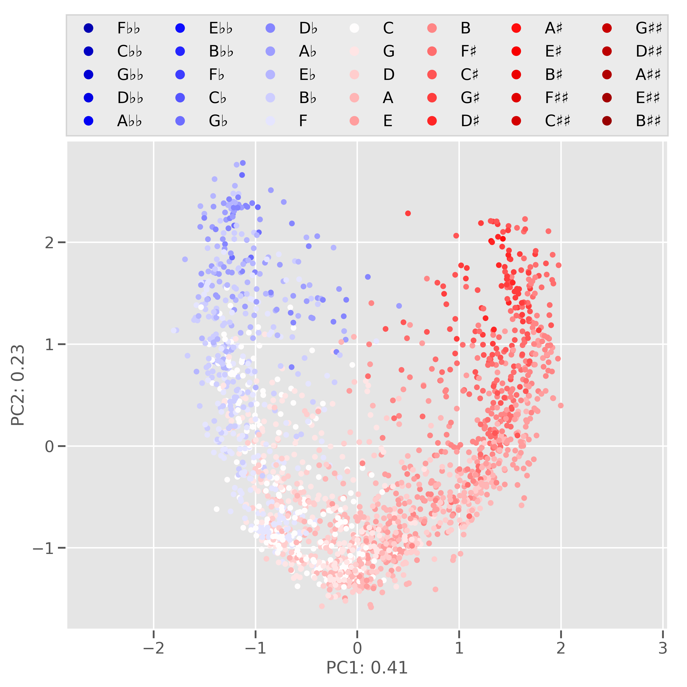]]

--

.right-col50[
- Focus on PCA (ICA?) but show also different methods
- tonal pitch-class co-evolution
]


---

## 2 Topic Modeling and Tonality
--

### Topic Modeling with Latent Dirichlet Allocation (LDA)
.center[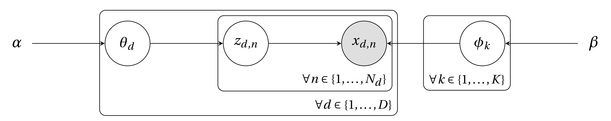<br />
.caption[Graphical Model for Latent Dirichlet Allocation .cite[(Blei et al., 2003)].]
]

.ref[
Blei, D. M., Ng, A. Y., & Jordan, M. I. (2003). Latent Dirichlet Allocation. _Journal of Machine
Learning Research_, 3, 993–1022. DOI: [10.1162/jmlr.2003.3.4-5.993](https://doi.org/10.1162/jmlr.2003.3.4-5.993)
]

---
## 2 Topic Modeling and Tonality

--

.left-col50[
Some topics reflect regions in tonal space.
.center[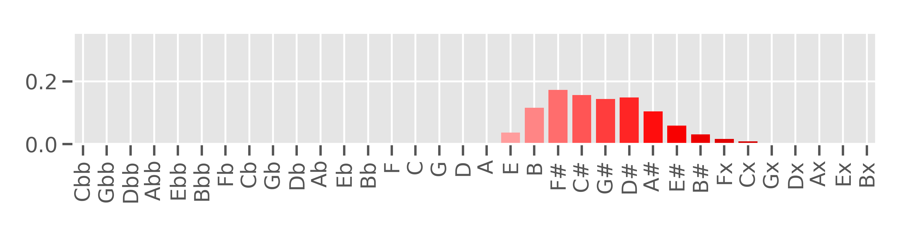<br />
.caption["Sharper" notes.]]
.center[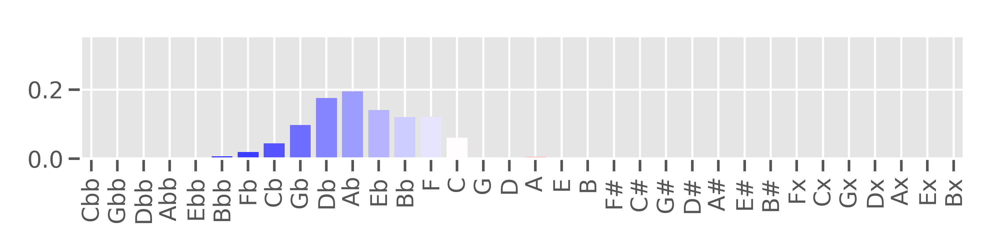<br />
.caption["Flatter" notes.]]]

--

.right-col50[
Others exhibit a more hierarchical structure.
.center[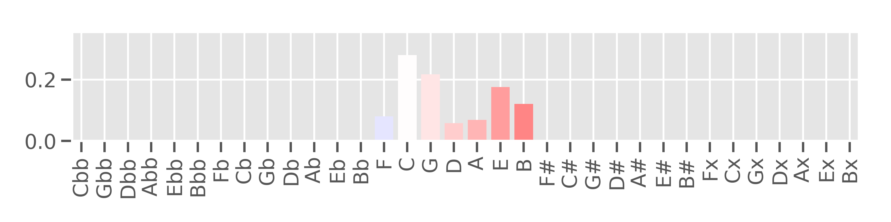<br />
.caption[Central notes emphasizing a C-major triad.]]
.center[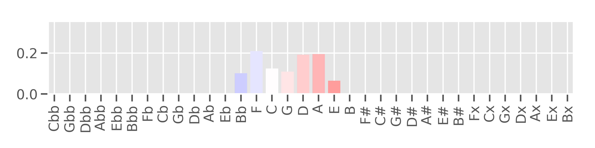<br />
.caption[Central notes emphasizing a D-minor triad.]]]

--

Topic modeling identifies regions in tonal space (central, flat, sharp)
and moreover points towards the importance of triads and tonal hierarchies.

---

## 3 Annotating Corpora with Harmonic Labels

.center[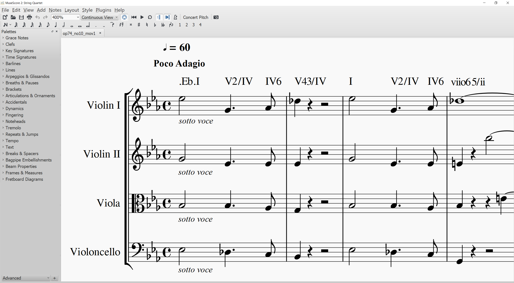<br />
.caption[Annotation interface _MuseScore_ (v2.0) showing the beginning of Beethoven's op. 74/1.]]

.center[
<audio controls>
  <source src="audio/beethoven_74_beginning.wav" type="audio/wav">
  Your browser does not support the audio element.
</audio>]

---

## 3 Annotating Corpora with Harmonic Labels

- chord symbols, e.g. `I`, `i`, `V` with certain **features**
- defined by a **regular expression**

```parser3
REGEX = r"""^
        (\.)?
        ((?P<key>[a-gA-G](b*|\#*)|(b*|\#*)(VII|VI|V|IV|III|II|I|vii|vi|v|iv|iii|ii|i))\.)?
        ((?P<pedal>(b*|\#*)(VII|VI|V|IV|III|II|I|vii|vi|v|iv|iii|ii|i))\[)?
        (?P<numeral>(b*|\#*)(VII|VI|V|IV|III|II|I|vii|vi|v|iv|iii|ii|i|Ger|It|Fr))
        (?P<form>[%o+M])?
        (?P<figbass>(9|7|65|43|42|2|64|6))?
        (\((?P<changes>(\+?(b*|\#*)\d)+)\))?
        (/\.?(?P<relativeroot>(b*|\#*)(VII|VI|V|IV|III|II|I|vii|vi|v|iv|iii|ii|i)))?
        (?P<pedalend>\])?
        (?P<phraseend>\\\\)?$
        """x
```

--
Questions:
- Distribution of chord features (V, C, Zipf)
- What is the significance of chord features for chord prediction?

.ref[Neuwirth, M., Harasim, D., Moss, F. C., & Rohrmeier, M. (2018).
The Annotated Beethoven Corpus (ABC): A Dataset of Harmonic Analyses of All Beethoven String Quartets.
*Frontiers in Digital Humanities, 5* (16).
DOI: [10.3389/fdigh.2018.00016](https://doi.org/10.3389/fdigh.2018.00016)]

---

## Chord Frequencies

The frequency-rank distribution of chord symbols follows a power law.
.center[
  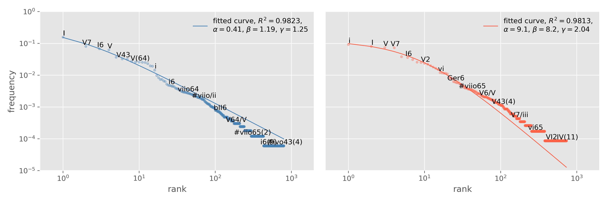<br />
  .caption[Chord symbols in Beethoven's string quartets in the major (left) and the minor mode (right).]
]


---

## Chord Transitions

.left-col50[
  .center[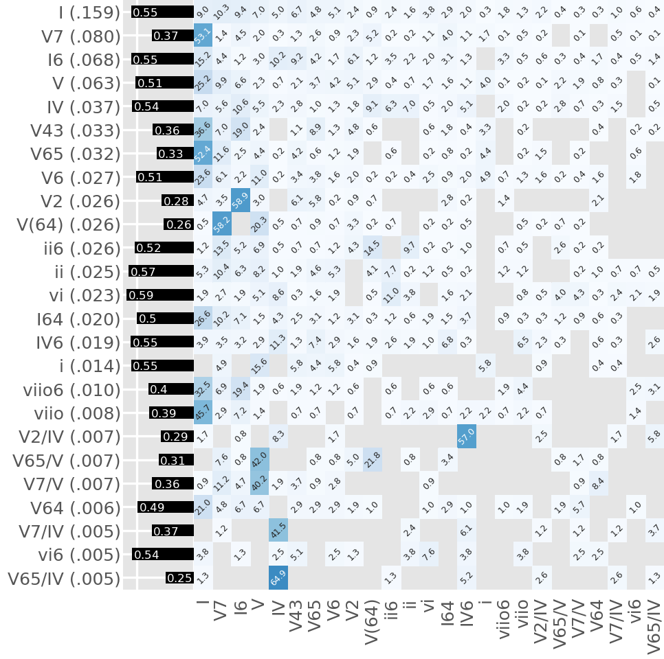]
]

.right-col50[
Chord transitions (bigrams) are asymmetric, e.g.
$$p(\\mathsf{V7} \\rightarrow \\mathsf{I}) \\gg p(\\mathsf{I} \\rightarrow \\mathsf{V7})$$
]

--

.right-col50[Conditional entropies (black bars) vary considerably]
--

.right-col50[- High entropies (uncertain continuation):
.center[`I`, `i`, `V`, `IV`, `vi`, `ii`, ...]]
--
.right-col50[- Low entropies (more certain continuation):
.center[`V2`, `V(64)`, `V65/IV`, ...]
]

--
.right-col50[
Variability seems to be related to chord features.
]
---

## Practices: affect of features for chord prediction

.left-col33[
1. Select all chords with a certain feature.
2. Calculate average normalized conditional entropy `\(\bar{H}_{avg}\)`.
3. Draw large number of bootstrap samples .cite[(Efron, 1979)].
4. The proportion of bootstrap samples more extreme than `\(\bar{H}_{avg}\)` determines statistical significance.

]

.right-col66[

.center[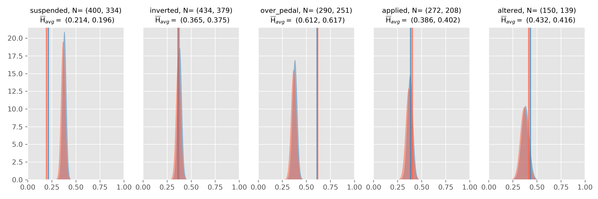]

]

.ref[
Moss, F. C., Neuwirth, M., Harasim, D., & Rohrmeier, M. (2019).
Statistical characteristics of tonal harmony: A corpus study of Beethoven's string quartets.
_PLOS ONE 14_(6): e0217242. DOI: [10.1371/journal.pone.0217242](https://doi.org/10.1371/journal.pone.0217242)

Efron, B. (1979). Bootstrap methods: Another look at the Jackknife. _The Annals of
Statistics, 7_(1), 1–26. DOI: [10.1214/aos/1176344552](https://doi.org/10.1214/aos/1176344552)
]

---

class: center, middle
# III. Prospects

---

## Prospects
### *Distant Listening* - The Development of Harmony over Three Centuries (1700–2000)

Setup:
- SNSF funded project
- 1 PI (Martin Rohrmeier), 2 PostDocs (Andrew McLeod, Fabian C. Moss), 1 PhD (Johannes Hentschel)
- 4 years (2019-22)


Scope:
1. Data: corpus creation/expansion (-> get RISM data?)
2. Computational modeling: harmonic inference (use annotated corpora as ground truth)
3. Theoretical advancement: music theory (re-evaluate musical theories of tonality, digital critique)

---

class: center, middle

# Many thanks to...

.left-col50[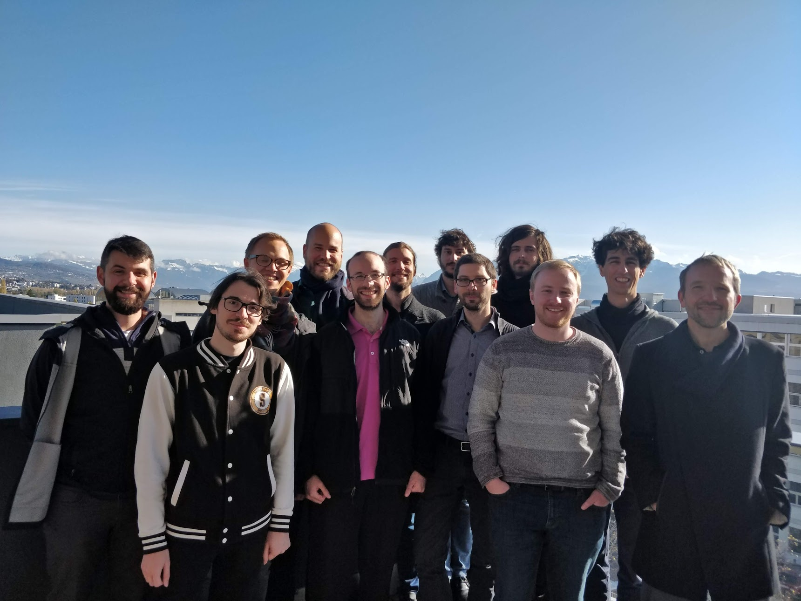]

.right-col50[.left[
- Nils Reiter for inviting me here

- my colleagues at the DCML

- Claude Latour for supporting the EPFL Chair in Digital Musicology

- SNSF for funding the _Distant Listening_ project
]]

.center[]


---

class: center, middle

# Computational Musicology and the Digital Humanities
## Problems, Practices, and Prospects

Fabian C. Moss ([@fabianmoss](https://twitter.com/fabianmoss))<br />
Digital and Cognitive Musicology Lab<br />
École Polytechnique Fédérale de Lausanne

18 February, 2020

CRETA-Werkstatt #9<br />
Center for Reflected Text Analytics, Universität Stuttgart


