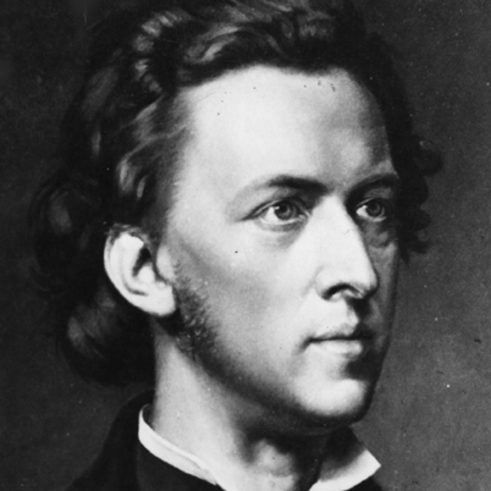

<!-- class: center, middle -->

# Computational Musicology and the Digital Humanities
## Problems, Practices, and Prospects

Fabian C. Moss ([@fabianmoss](https://twitter.com/fabianmoss))<br />
École Polytechnique Fédérale de Lausanne

18 February, 2020

CRETA-Werkstatt #9<br />
Center for Reflected Text Analytics, Universität Stuttgart


---

## Outline
--

1. Problems: the peculiar case of music

--

2. Practices: results from thesis
 1. inference of latent tonal spaces
 2. topic models (focus on difficulty to interpret topics, here the tonal spaces help, they define the "semantics" of tpcs as interrelations/itnervals)
 3. affect of features for chord prediction

--

3. Prospects: the *Distant Listening* project

---

## Problems: The peculiar case of music

- what is musical text?
- how does it differ from linguistic text?
- seemingly 2-dimensional (pitch/time) but pitch-dimension actually multidimensional
- the score can be understood as dimensionality reduction for performance
- practical problems:
 - OMR relatively bad; small mistakes can make huge difference
 - scarcity of (text) corpora (as opposed to recordings)

???

# These are my notes

---

## Problems: Corpora, Representativity

.alert[(No real need to present the corpora to this audience.)]

Harmonic Annotations:
- published:
 - Annotated Beethoven Corpus ([ABC](http://github.com/DCMLab/ABC))
 - Mozart Sonatas (submitted)
- in preparation:
  - X composers
  - Y pieces
  - Z1-Z2 years

Notes:
- Tonal Pitch-Class Counts Corpus ([TP3C](https://github.com/DCMLab/TP3C))

But compare to [RISM database](https://opac.rism.info):
- 1,198,605 musical sources (as of 12 Feb)
--

- ca. 36,000 composers
--

- mostly between 1650 and 1850 (printed music)

---

## Audio test

<div align="center">

<br />
<audio controls>
  <source src="audio/chopin.mp3" type="audio/mpeg">
  Your browser does not support the audio element.
</audio>
<br />
</div>
.center[[Link to full performance](https://www.youtube.com/watch?v=jJ130s7BiSM)]

---

## Practices: inference of latent tonal spaces

- Focus on PCA (ICA?) but show also different methods
- tonal pitch-class co-evolution

---

## Practices: topic modeling tonality

---

## Practices: modeling chords and creating corpora

- chord symbols, e.g. `I`, `i`, `V` with certain **features**
- defined by a **regular expression**

```parser3
REGEX = r"""^
        (\.)?
        ((?P<key>[a-gA-G](b*|\#*)|(b*|\#*)(VII|VI|V|IV|III|II|I|vii|vi|v|iv|iii|ii|i))\.)?
        ((?P<pedal>(b*|\#*)(VII|VI|V|IV|III|II|I|vii|vi|v|iv|iii|ii|i))\[)?
        (?P<numeral>(b*|\#*)(VII|VI|V|IV|III|II|I|vii|vi|v|iv|iii|ii|i|Ger|It|Fr))
        (?P<form>[%o+M])?
        (?P<figbass>(9|7|65|43|42|2|64|6))?
        (\((?P<changes>(\+?(b*|\#*)\d)+)\))?
        (/\.?(?P<relativeroot>(b*|\#*)(VII|VI|V|IV|III|II|I|vii|vi|v|iv|iii|ii|i)))?
        (?P<pedalend>\])?
        (?P<phraseend>\\\\)?$
        """x
```

--
Questions:
- Distribution of chord features (V, C, Zipf)
- What is the significance of chord features for chord prediction?

.reference[Neuwirth, Harasim, Moss, & Rohrmeier (2018).
The Annotated Beethoven Corpus (ABC): A Dataset of Harmonic Analyses of All Beethoven String Quartets.
*Frontiers in Digital Humanities, 5* (16).
DOI: [10.3389/fdigh.2018.00016](https://doi.org/10.3389/fdigh.2018.00016)]

---

## Practices:

.center[]

---
## Practices:

.center[]

---

## Practices: affect of features for chord prediction

.center[]

.reference[Moss, Neuwirth, Harasim, & Rohrmeier (2019).
Statistical characteristics of tonal harmony: A corpus study of Beethoven's string quartets.
_PLOS ONE 14_(6): e0217242. DOI: [10.1371/journal.pone.0217242](https://doi.org/10.1371/journal.pone.0217242)]

---

class: center, middle

# Prospects

---

## Prospects: the *Distant Listening* project

Setup:
- SNF funded project
- 1 PI, 2 PostDocs, 1 PhD
- 3 years (2020-22)


Scope:
1. Data: corpus creation/expansion (-> get RISM data?)
2. Computational modeling: harmonic inference (use annotated corpora as ground truth)
3. Theoretical advancement: music theory (re-evaluate musical theories of tonality, digital critique)

---

class: center, middle

# Acknowledgements


.left[
- DCML
- SNF
- Claude Latour
]
